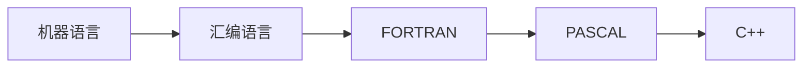

# （一）计算机系统概述

## 1. 计算机的发展

本节知识脑图

### 1.1 什么是计算机系统

$  
    计算机系统 = 硬件 + 软件  
$  

> 计算机性能的好坏取决于“软”、硬”件功能的总和

软件的分类

1. 系统软件
    用来管理整个计算机系统（操作系统，DBMS，IDE）
2. 应用软件
    按任务需要编制的各种程序（LOL、美图秀秀...）

### 1.2 硬件的发展

#### 1. 第一代：电子管时代  
世界上第一台电子数字计算机：ENIAC (1946)
- 逻辑元件：使用了 1.8W 个电子管
- 涉及人员：冯·诺伊曼
- 特性：体积超大、耗电快
- 机器语言编程

#### 2. 第二代：晶体管时代

- 逻辑元件：晶体管
- 特性：体积、功耗降低
- 出现了面向过程程序设计语言：FORTRAN
- 有了操作系统雏形

#### 3. 第三代：中小规模集成电路时代

- 元件集成在基片上
- 计算机主要用于科学计算等专业用途
- 高级语言迅速发展
- 开始有了分时操作系统

#### 4. 第四代：大规模、超大规模集成电路时代

- 开始出现 “微处理器”、微型计算机个人计算机（PC)萌芽
- 操作系统: Windows、MacOs、 Linux...

**微处理器的发展：**

- 微型计算机的发展以 **微处理器技术** 为标志.

- **机器字长**: 计算机一次整数运算所能处理的二进制位数

- **摩尔定律**：摩尔定律揭示了信息技术进步的速度。集成电路上可容纳的晶体管数目，约每隔18个月便会增加一倍，整体性能也将提升一倍。

### 1.3 软件的发展

> 编程语言的发展一定程度上体现了软件的发展。

#### 编程语言的发展

#### 目前发展趋势

两级分化趋势：

1. 一极是微型计算机向更微型似、网络化、高性能(多用途方向发展;
2. 另一极是巨型机向更巨型化、超高速、并行处理、智能化方向发展。

> 点击查看超级计算机世界排名：https://www.top500.org/

## 2. 计算机硬件的基本组成

**本节脑图**

### 2.1 早期冯诺依曼机

第一台电子计算机 ENIAC 手动接线来控制计算。

**存储程序** 的概念是指凝指令以二进制代码的形式事先输入计算机的主存储器，然后按其在存储器中的首地址执行程序的第一条指令，以后就按该程序的规定顺序执行其他指令，直至程序执行结束。

第一台采用冯诺依曼结构的计算机：EDVAC

**示意图**

在计算机系统中 **软件和便件在逻辑上是等效的**。
> Eg: 对于乘法运算,可以设计一个专门的硬件电路实现。乘法运算也可以用软件的方式，执行多次加法运算来实现。

**冯·诺依曼计算机的特点**:

1. 计算机由五大部件组成
2. 指令和数据以同等地位存于存储
器，可按地址寻访
3. 指令和数据用二进制表示
4. 指令由操作码和地址码组成
5. 存储程序
6. **以运算器为中心**
    输入/输出设备与存储器之间的数据传送通过运算器完成

### 2.2 现代计算机

**示意图**

- 现代计算机: 以存储器为中心
- CPU = 运算器 + 控制器

**简化版**

## 3. 认识各个硬件部分

本章思维导图：

### 3.1 主存储器的基本组成

- **MAR**：Memmery Address Register，存储地址寄存器
- **MDR**：Memmery Data Register，存储数据寄存器
- **存储单元**：每个存储单元存放一串二进制代码
- **存储字 (word)**: 存储单元中二进制代码的组合
- **存储字长**: 存储单元中二进制代码的位数
- **存储元**：即存储二进制的电子元件，每个存储元可存 `1bit`

> MDR 位数=存储字长，存储字长又决定存储单元个数。

**易混淆**:

1个字节（`Byte`） = 8 `bit`
`1B` =1个字节，`1b` =1个 `bit`

### 3.2 运算器的基本组成

- ACC: 累加器，用于存放操作数，或运算结果。
- MQ: 乘商寄存器，在乘、除运算时，用于存放操作数或运算结果。
- x: 通用的操作数寄存器，用于存放操作数
- ALU: 算术逻辑单元，通过内部复杂的电路实现算数运算、逻辑运算

### 3.3 控制器的基本组成

