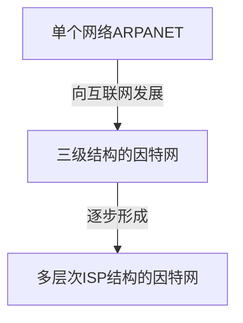
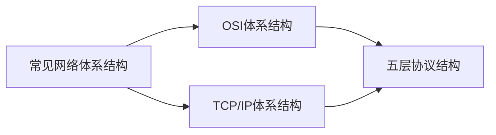

# （一）计算机网络概述

<font color=red size=4>重要：</font>
本笔记是根据这个计网课程记录的：[湖大教书匠-计算机网络微课堂](https://www.bilibili.com/video/BV1c4411d7jb?from=search&seid=17307013788614949776)  
目前，由于时间和精力有限，不再更新。未更新的部分给出课程全部课件PDF：  
> 阿里云盘不限速下载：链接：https://www.aliyundrive.com/s/zkQuo7XooKR


## 1. 计算机网络在信息时代的作用

- 计算机网络已由一种通信基础设施发展成为一种重要的信息服务基础设施。  
- 计算机网络已经像水、电、煤气这些基础设施一样，成为我们生活中不可或缺的一部分。

## 2. 因特网概述

### 2.1 网络、互连网(互联网)和因特网

1. 网络(Network)由若干结点(Node)和连接这些结点的链路(Link)组成。

2. 多个网络还可以通过路由器互连起来，这样就构成了一个覆盖范围更大的网络，即互联网（或互连网)因此，互联网是“网络的网络(Netwrok of Networks) "。

3. 因特网(Internet)是世界上最大的互连网络（用户数以亿计，互连的网络数以百万计)。

4. internet与lnternet的区别  
    **internet(互联网或互连网)** 是一个通用名词，它泛指由多个计算机网络互连而成的网络。在这些网络之间的通信协议可以是任意的。  
    **Internet(因特网)** 则是一个专用名词，它指当前全球最大的、开放的、由众多网络相互连接而成的特定计算机网络，它采用TCP/IP协议族作为通信的规则，其前身是美国的 **ARPANET**。

### 2.2 因特网发展的三个阶段 



#### 1. 从单个网络ARPANET向互联网发展

- 1969年，第一个分组交换网 **ARPANET**;
- 70年代中期，研究多种网络之间的互连;
- 1983年,TCP/IP协议成为ARPANET的标准协议(因特网诞生时间)

#### 2. 逐步建成三级结构的因特网

- 1985年，NSF围绕六个大型计算机中心建设NSFNET（主干网、地区网和校园网）;
- 1990年，ARPANET任务完成，正式关闭;
- 1991年，美国政府将因特网主干网交给私人公司经营，并开始对接入因特网的单位收费;

#### 3. 多层次ISP结构的因特网

- 1993年，NSFNET逐渐被若干个商用因特网主干网替代;政府机构不再负责因特网运营，让各种因特网服务提供者ISP来运营。  
- 1994年，万维网wwW技术促使因特网迅猛发展;  
- 1995年，NSFNET停止运作，因特网彻底商业化。  

> ISP: 因特网服务提供者ISP（Internet Service Provider）


### 2.3 因特网的标准化工作

1. 因特网的标准化工作对因特网的发展起到了非常重要的作用。
2. 因特网在制定其标准上的一个很大的特点是面向公众。
    - 因特网所有的RFC(Request For Comments)技术文档都可从因特网上免费下载;(http://www.ietf.org/rfc.html)
    - 任何人都可以随时用电子邮件发表对某个文档的意见或建议。
3. 因特网协会ISOC是一个国际性组织，它负责对因特网进行全面管理，以及在世界范围内促进其发展和使用。
    - 因特网体系结构委员会IAB，负责管理因特网有关协议的开发;
    - 因特网工程部IETF，负责研究中短期工程问题，主要针对协议的开发和标准化;
    - 因特网研究部IRTF，从事理论方面的研究和开发一些需要长期考虑的问题。

4. 制订因特网的正式标准要经过以下4个阶段:
    1. 因特网草案(在这个阶段还不是RFC文档)
    2. 建议标准 (从这个阶段开始就成为RFC文档)
    3. 草案标准 (目前已取消)
    4. 因特网标准


### 2.4 因特网组成

因特网由边缘部分和核心部分组成。

#### 1. 边缘部分

由所有连接在因特网上的 **主机** 组成。这部分是 **用户直接** 使用的，用来进行 **通信** （传送数据、音频或视频）和 **资源共享**

#### 2. 核心部分

由 **大量网络** 和连接这些网络的 **路由器** 组成。这部分是 **为边缘部分提供服务** 的(提供连通性和交换)

## 3. 三种交换方式

- 电路交换（Circuit Switching）
- 分组交换（Packet Switching）
- 报文交换（Message Switching）

### 3.1 电路交换

电话交换机接通电话线的方式称为电路交换;

从通信资源的分配角度来看，交换(Switching）就是按照某种方式动态地分配传输线路的资源;

电路交换的三个步骤：
1. 建立连接（分配通信资源)
2. 通话（一直占用通信资源)
3. 释放连接（归还通信资源)


> 当使用电路交换来传送计算机数据时, 其线路的传输效率往往很低。

### 3.2 分组交换


### 3.3 报文交换

报文交换对报文的大小没有限制，这就要求结点有较大的缓存空间。报文交换主要用于早期的电报通信网，现在较少使用。通常被较先进的分组交换方式所替代。

### 3.4 三种方式对比


## 4. 计算机网络的定义和分类

### 4.1 计算机网络的定义

- 计算机网络的精确定义并未统一
- 计算机网络的最简单的定义是: 一些 **互相连接** 的、**自治** 的计算机的 **集合**。
    - **互连** 是指计算机之间可以通过有线或无线的方式进行数据通信
    - **自治** 是指独立的计算机，它有自己的硬件和软件，可以单独运行使用
    - **集合** 是指至少需要两台计算机
- **计算机网络的较好的定义** 是: 计算机网络主要是由一些 **通用的、可编程的硬件互连** 而成的，而这些硬件并非专门用来实现某一特定目的（例如，传送数据或视频信号)。这些可编程的硬件能够用来 **传送多种不同类型的数据**，并能 **支持广泛的和日益增长的应用**。  
    该定义表明：
    - 计算机网络所连接的硬件，并不限于一般的计算机，而是包括了智能手机等智能硬件。
    - 计算机网络并非专门用来传送数据，而是能够支持很多种的应用（包括今后可能出现的各种应用)


> 以下系统并不是一个计算机网络。
> 因为图示终端机只是具有显示和输入设备的终端，不是自治的计算机。因此，这只是一个运行分时系统的大型机系统。
> 
> 

### 4.2 计算机网络的分类

1. 按照交换技术分类
    - 电路交换网络
    - 报文交换电路
    - 分组交换电路
2. 按使用者分类
    - 公用网
    - 专用网
3. 按照传输介质分类
    - 有线网
    - 无线网
4. 按覆盖范围分类
    - 广域网 WAN
    - 城域网 MAN
    - 局域网 LAN
    - 个域网 PAN
5. 按拓扑结构分类
    - 总线型网络
    - 星型网络
    - 环型网络
    - 网状型网络

## 5. 计算机网络的性能指标

### 5.1 常用性能指标

性能指标可以从不同的方面来度量计算机网络的性能。
常用的计算机网络的性能指标有以下8个:
- 速率
- 带宽
- 吞吐量
- 时延
- 时延带宽积
- 往返时间
- 利用率
- 丢包率

### 5.2 速率

#### 1. 比特

计算机中 **数据量的单位**，也是信息论中信息量的单位。一个比特就是二进制数字中的一个 `1` 或 `0`。

常用数据量单位:  
```
8 bit = 1 Byte  
KB = 2^10B  
MB = K·KB = 2^10·2^10 B = 2^20 B  
GB = K·MB = 2^10·2^20 B = 2^30 B  
TB = K·GB = 2^10·2^30 B = 2^40 B  
```
#### 2. 速率

连接在计算机网络上的主机在数字信道上传送比特的速率，也称为 **比特率** 或 **数据率**。

常用数据单位：  
```
bit/s (b/s，bps)  
kb/s = 10^3 b/s (bps)    
Mb/s = k·kb/s = 10^3·10^3 bls = 10^6 b/s (bps)   
Gb/s = k·Mb/s = 10^3·10^6 b/s = 10b/s (bps)    
Tb/s = k·Gb/s = 10^3·10^9 b/s = 10"2 bls (bps)
```

例1：例1∶有一个待发送的数据块，大小为100 MB，网卡的发送速率为100 Mbps，则网卡发送完该数据块需要多长时间?  

$$
T=\frac{100MB}{100Mb/s}=\frac{MB}{Mb/s}=\frac{2^{20}B}{10^6b/s}=\frac{2^{20}\cdot{8b}}{10^6b/s}=8.388608 s
$$

### 5.3 带宽

带宽在模拟信号系统中的意义：信号所包含的各种不同频率成分所占据的频率范围。

**带宽在计算机网络中的意义**：用来表示网络的通信线路所能传送数据的能力，因此网络带宽表示在单位时间内从网络中的某一点到另一点所能通过的 **“最高数据率”**。  
单位：b/s, (kb/s, Mb/s, Gb/s, Tb/s)

**其实,“带宽”的这两种表述之间有着密切的联系。一条通信线路的“频带宽度”越宽,其所传输数据的“最高数据率”也越高。**

### 5.4 吞吐量

- 吞吐量表示在单位时间内 **通过某个网络(或信道、接口)的数据量。**
- 吞吐量被经常用于对现实世界中的网络的一种测量，以便知道实际上到底有多少数据量能够通过网络。
- 吞吐量受 **网络的带宽或额定速率** 的限制。

### 5.5 时延

$$
网络时延=发送时延+传播时延+处理时延
$$

#### 1. 发送时延

$$
发送时延=\frac{分组长度(b)}{发送速率(b/s)}
$$

发送速率受 **网卡的发送速率** 、**信道带宽**、**接口速率** 影响。

#### 2. 传播时延

$$
传播时延=\frac{信道长度(m)}{电磁波传播速率(m/s)}
$$

电磁波在 **自由空间** 的传播速率 $v=3\times10^8 m/s$  
在铜线中：$v=2.3\times10^8 m/s$  
在光纤中：$v=2.0\times10^8 m/s$  

**要计算传播时延，先确定传播媒体。**

#### 3. 处理时延

不方便计算。

> 发送时延占主导还是传播时延占主导，要根据具体例子实际分析。


### 5.6 时延带宽积

$$
时延带宽积=传播时延\times带宽
$$

- 若发送端连续发送数据，则在所发送的第一个比特即将到达终点时，发送端就已经发送了时延带宽积个比特  
- 链路的时延带宽积又称为 **以比特为单位的链路长度**。

### 5.7 往返时间RTT

- **从发送端发送信息开始，到发送端接收到来自接受端发送的确认信息，称为往返时间RTT。**
- 在许多情况下，因特网上的信息不仅仅单方向传输，而是双向交互
- 我们有时很需要知道双向交互一次所需的时间;
- 因此，往返时间 RTT(Round-Trip Time)也是一个重要的性能指标。

### 5.8 利用率

利用率分类为 **信道利用率** 和 **网络利用率**

- 信道利用率：用来表示某信道有百分之几的时间是被利用的（有数据通过)
- 网络利用率：全网络的信道利用率的加权平均

根据排队论，**当某信道的利用率增大时，该信道引起的时延也会迅速增加**。

如果令：

- $D_0$：网络空闲时延
- $D$：网络当前时延
- $U$：利用率

那么则有下列关系：
$$
D=\frac{D_0}{1-U}
$$


- 当网络的利用率达到50%时，时延就要加倍
- 当网络的利用率超过50%时，时延急剧增大
- 当网络的利用率接近100%时，时延就趋于无穷大
- 因此，一些拥有较大主干网的ISP通常会控制它们的信道利用率不超过50%。如果超过了，就要准备扩容，增大线路的带宽

也不能使信道利用率太低，这会使宝贵的通信资源被白白浪费。应该使用一些机制，可以根据情况动态调整输入到网络中的通信量，使网络利用率保持在合理范围内。

### 5.9 丢包率

1. 丢包率即分组丢失率，是指在一定的时间范围内，传输过程中 **丢失的分组数量与总分组数量的比率**。
2. 丢包率具体可分为接口丢包率、结点丢包率、链路丢包率、路径丢包率、网络丢包率等。
3. 丢包率是 **网络运维人员** 非常关心的一个网络性能指标，但对于普通用户来说往往并不关心这个指标，因为他们通常意识不到网络丢包。
4. 分组丢失主要有两种情况:
    - 分组在传输过程中出现 **误码**，被结点丢弃;
    - 分组到达一台队列已满的分组交换机时被丢弃;
    - 在通信量较大时就可能造成 **网络拥塞**。
5. 因此，丢包率反映了网络的拥塞情况:
    - 无拥塞时路径丢包率为0
    - 轻度拥塞时路径丢包率为1%~4%
    - 严重拥塞时路径丢包率为5%~15%

## 6. 计算机网络体系结构

### 6.1 常见的计算机网络体系结构



#### 1. OSI体系结构

法律上的国际标准时 OSI 七层体系结构，但由于专家却反实际经验、分层过于复杂、指定周期长、层次划分不合理等原因，并没有投入实际引用。


#### 2. TCP/IP体系结构


#### 3. 五层协议体系结构

结合了 OSI 和 TCP/IP 的特点，一般用于学习。


### 6.2 计算机网络体系结构分层的必要性

- **计算机网络是个非常复杂的系统**。早在最初的ARPANET设计时就提出了分层的设计理念。
- **"分层"** 可将庞大而复杂的问题，转化为若干较小的局部问题，而这些较小的局部问题就比较易于研究和处理。

下面按照由简单到复杂的顺序，来看看实现计算机网络要面临哪些主要的问题，以及如何将这些问题划分到相应的层次，层层处理。


### 6.3 计算机网络体系结构分层思想举例


### 6.4 计算机网络体系结构中的专用术语

#### 1. 实体

实体：任何可发送或接受信息的 **硬件** 或 **软件进程**。  
对等实体：收发双方 **相同层次中的实体**。


#### 2. 协议

协议：控制两个对等实体进行逻辑通信的规则的集合。协议的三要素：语法、语义、同步  
- 语法：定义所交换信息的格式  
- 语义：定义收发双方所要完成的操作  
- 同步：定义收发双方的时序关系  


- 在协议的控制下，两个对等实体间的逻辑通信使得本层能够向上一层提供服务。  
- 要实现本层协议，还需要使用下面一层所提供的服务。
- **协议是“水平的”，服务是“垂直的”。**
- 实体看得见相邻下层所提供的服务，但并不知道实现该服务的具体协议。也就是说，下面的协议对上面的实体是 **"透明"** 的。

#### 3. 服务

- **服务访问点**：在同一系统中相邻两层的实体交换信息的逻辑接口，用于区分不同的服务类型。
    - 数据链路层的服务访问点为帧的“类型”字段。
    - 网络层的服务访问点为IP数据报首部中的“协议字段”。
    - **运输层的服务访问点为“端口号”。**
- **服务原语**：上层使用下层所提供的服务必须通过与下层交换一些命令，这些命令称为服务原语。
- **协议数据单元PDU**：对等层次之间传送的数据包称为该层的协议数据单元。
- **服务数据单元SDU**：同一系统内，层与层之间交换的数据包称为服务数据单元。
- 多个SDU可以合成为一个PDU，一个SDU也可划分为几个PDU。


## 7. 总时延计算

假设:分组等长，各链路长度相同、带宽也相同，忽略路由器的处理时延。  
若有 $n$ 个分组，$m$ 段链路，则总时延计算公式为：  

$$
总时延 = n个分组的发送时延 + 1 个分组的发送时延 \times (m-1) + 1段链路的传播时延\times m
$$ 
设：
- 总时延：$T$
- 一个分组的发送时延：$t_0$
- 一段链路的传播时延：$t_s$  

则有：

$$
T=n \times t_0 + (m-1) \times t_0 + m \times t_s
$$ 
> 公式理解：除了 $n \times t_0$，其他都只计算最后一个分组。

**注意**  
> 注意题目中，分组文件大小和分组头大小的区分。转发过程中，会给分组加上分组头。