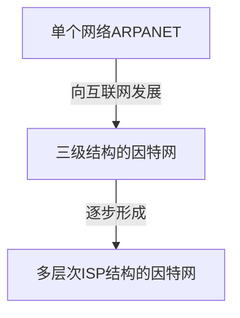

# （一）计算机网络概述

## 1. 计算机网络在信息时代的作用

- 计算机网络已由一种通信基础设施发展成为一种重要的信息服务基础设施。  
- 计算机网络已经像水、电、煤气这些基础设施一样，成为我们生活中不可或缺的一部分。

## 2. 因特网概述

### 2.1 网络、互连网(互联网)和因特网

1. 网络(Network)由若干结点(Node)和连接这些结点的链路(Link)组成。

2. 多个网络还可以通过路由器互连起来，这样就构成了一个覆盖范围更大的网络，即互联网（或互连网)因此，互联网是“网络的网络(Netwrok of Networks) "。

3. 因特网(Internet)是世界上最大的互连网络（用户数以亿计，互连的网络数以百万计)。

4. internet与lnternet的区别  
    **internet(互联网或互连网)** 是一个通用名词，它泛指由多个计算机网络互连而成的网络。在这些网络之间的通信协议可以是任意的。  
    **Internet(因特网)** 则是一个专用名词，它指当前全球最大的、开放的、由众多网络相互连接而成的特定计算机网络，它采用TCP/IP协议族作为通信的规则，其前身是美国的 **ARPANET**。

### 2.2 因特网发展的三个阶段 

#### 1. 从单个网络ARPANET向互联网发展

- 1969年，第一个分组交换网 **ARPANET**;
- 70年代中期，研究多种网络之间的互连;
- 1983年,TCP/IP协议成为ARPANET的标准协议(因特网诞生时间)

#### 2. 逐步建成三级结构的因特网

- 1985年，NSF围绕六个大型计算机中心建设NSFNET（主干网、地区网和校园网）;
- 1990年，ARPANET任务完成，正式关闭;
- 1991年，美国政府将因特网主干网交给私人公司经营，并开始对接入因特网的单位收费;

#### 3. 多层次ISP结构的因特网

- 1993年，NSFNET逐渐被若干个商用因特网主干网替代;政府机构不再负责因特网运营，让各种因特网服务提供者ISP来运营。  
- 1994年，万维网wwW技术促使因特网迅猛发展;  
- 1995年，NSFNET停止运作，因特网彻底商业化。  

> ISP: 因特网服务提供者ISP（Internet Service Provider）

### 2.3 因特网的标准化工作

1. 因特网的标准化工作对因特网的发展起到了非常重要的作用。
2. 因特网在制定其标准上的一个很大的特点是面向公众。
    - 因特网所有的RFC(Request For Comments)技术文档都可从因特网上免费下载;(http://www.ietf.org/rfc.html)
    - 任何人都可以随时用电子邮件发表对某个文档的意见或建议。
3. 因特网协会ISOC是一个国际性组织，它负责对因特网进行全面管理，以及在世界范围内促进其发展和使用。
    - 因特网体系结构委员会IAB，负责管理因特网有关协议的开发;
    - 因特网工程部IETF，负责研究中短期工程问题，主要针对协议的开发和标准化;
    - 因特网研究部IRTF，从事理论方面的研究和开发一些需要长期考虑的问题。

4. 制订因特网的正式标准要经过以下4个阶段:
    1. 因特网草案(在这个阶段还不是RFC文档)
    2. 建议标准(从这个阶段开始就成为RFC文档)
    3. 草案标准
    4. 因特网标准

### 2.4 因特网组成

因特网由边缘部分和核心部分组成。

#### 1. 边缘部分

由所有连接在因特网上的 **主机** 组成。这部分是 **用户直接** 使用的，用来进行 **通信** （传送数据、音频或视频）和 **资源共享**

#### 2. 核心部分

由 **大量网络** 和连接这些网络的 **路由器** 组成。这部分是 **为边缘部分提供服务** 的(提供连通性和交换)

## 3. 三种交换方式

- 电路交换（Circuit Switching）
- 分组交换（Packet Switching）
- 报文交换（Message Switching）

### 3.1 电路交换

电话交换机接通电话线的方式称为电路交换;

从通信资源的分配角度来看，交换(Switching）就是按照某种方式动态地分配传输线路的资源;

电路交换的三个步骤：
1. 建立连接（分配通信资源)
2. 通话（一直占用通信资源)
3. 释放连接（归还通信资源)

> 当使用电路交换来传送计算机数据时, 其线路的传输效率往往很低。

### 3.2 分组交换

### 3.3 报文交换

报文交换对报文的大小没有限制，这就要求结点有较大的缓存空间。报文交换主要用于早期的电报通信网，现在较少使用。通常被较先进的分组交换方式所替代。

### 3.4 三种方式对比

