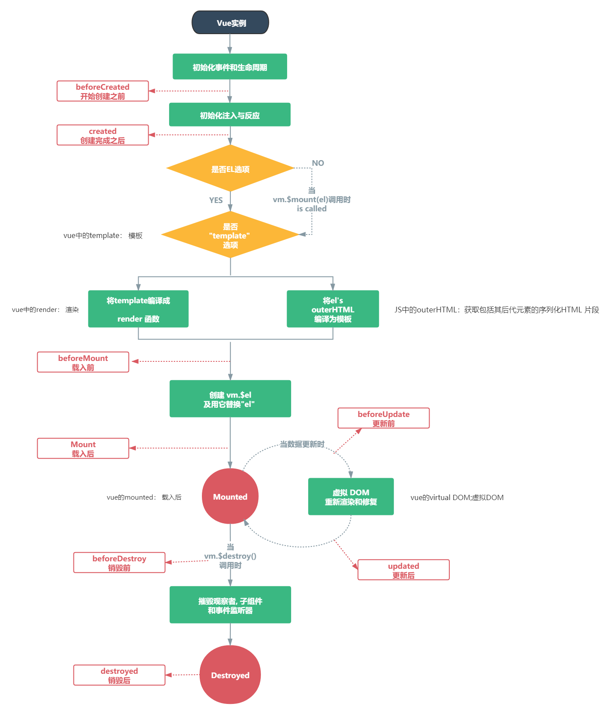

# 一、Webpack

## 1 Webpack基本概念

### 1.0 为什么要学习Webpack

1. 减少文件数量 

2. 缩减代码体积  
3. 提高浏览器打开的速

### 1.1 Webpack基本概述

Webpack本质是, 一个第三方模块包, 用于分析, 并打包代码

- 支持所有类型文件的打包
- 支持less/sass => css
- 支持ES6/7/8 => ES5 
-  压缩代码, 提高加载速度

## 2 Webpack使用步骤

### 2.0 环境准备

初始化包环境

```shell
yarn init
```

安装依赖包

```shell
yarn add webpack webpack-cil -D
```

配置scripts (自定义命令)

```shell
"script":{
	"build":"webpack"
},
```

Webpack基础使用 

需求： 2个js文件 ->打包成1个js文件 

分析： 

①：新建src下的资源 

②：add.js – 定义求和函数并导出 

③：index.js – 引入add模块并使用函数输出结果 

④：执行 `yarn build` 自定义命令, 进行打包 (确保终端路径在src的父级文件夹) 

⑤：打包后默认生成dist和main.js, 观察其中代码

webpack再次打包

需求：代码更多后, 如何打包呢? 

分析： 

①：src下新建tool/tool.js 

②：定义数组求和函数导出 

③：index.js – 引入tool模块的函数并使用, 打印结果 

④：执行 `yarn build` 自定义命令, 进行打包 (确保终端路径在src的父级文件夹)

⑤：打包后默认生成dist和main.js, 观察其中代码

## 3 Webpack的配置

### 3.0 Webpack-入口和出口

配置文档: https://webpack.docschina.org/concepts/#entry

1. 新建webpack.config.js 

2. 填入配置 
3. 修改入口文件名 
4. 打包观察效果

**注意:** webpack基于node, 所以导出, 遵守CommonJS规范

### 3.1 yarn build执行流程图

### 3.3 html-webpack-plugin插件

配置文档: https://webpack.docschina.org/plugins/html-webpack-plugin/

1. 下载插件

```shell
yarn add html-webpack-plugin -D
```

2. webpack.config.js添加配置

```js
// 引入自动生成 html 的插件
const HtmlWebpackPlugin = require('html-webpack-plugin')

module.exports = {
    // ...省略其他代码
    plugins: [
        new HtmlWebpackPlugin({
            template: './public/index.html' // 以此为基准生成打包后html文件
        })
    ]
}
```

3. 重新打包后观察dist下是否多出html并运行看效果

==打包后的index.html自动引入打包后的js文件==

> 总结: webpack就像一个人, webpack.config.js是人物属性, 给它穿什么装备它就干什么活

### 3.4_加载器 - 处理css文件问题

> 目标: 自己准备css文件, 引入到webpack入口, 测试webpack是否能打包css文件

1.新建 - src/css/index.css

2.编写去除li圆点样式代码

3.(重要) 一定要引入到入口才会被Webpack打包

4.执行打包命令观察效果

> 总结: 保存原因, 因为webpack默认只能处理js类型文件

### 3.5_加载器 - 处理css文件

> 目标: loaders加载器, 可让webpack处理其他类型的文件, 打包到js中

原因: Webpack默认只认识 js 文件和 json文件

[style-loader文档](https://webpack.docschina.org/loaders/style-loader/)

[css-loader文档](https://webpack.docschina.org/loaders/css-loader/)

1. 安装依赖

   ```
   yarn add style-loader css-loader -D
   ```

2. Webpack.config.js 配置

   ```js
   const HtmlWebpackPlugin = require('html-webpack-plugin')
   
   module.exports = {
       // ...其他代码
       module: { 
           rules: [ // loader的规则
             {
               test: /\.css$/, // 匹配所有的css文件
               // use数组里从右向左运行
               // 先用 css-loader 让webpack能够识别 css 文件的内容并打包
               // 再用 style-loader 将样式, 把css插入到dom中
               use: [ "style-loader", "css-loader"]
             }
           ]
       }
   }
   ```

3. 新建src/css/li.css - 去掉li默认样式

   ```css
   ul, li{
       list-style: none;
   }
   ```

4. 引入到main.js (因为这里是入口需要产生关系, 才会被Webpack找到打包起来)

   ```js
   import "./css/index.css"
   ```

5. 运行打包后dist/index.html观察效果和css引入情况

> 总结: 万物皆模块, 引到入口, 才会被webpack打包, css打包进js中, 然后被嵌入在style标签插入dom上

### 3.6_加载器 - 处理less文件

> 目标: less-loader让webpack处理less文件, less模块翻译less代码

[less-loader文档](https://webpack.docschina.org/loaders/less-loader/)

1. 下载依赖包

   ```bash
   yarn add less less-loader -D
   ```

2. Webpack.config.js 配置

   ```js
   module: {
     rules: [ // loader的规则
       // ...省略其他
       {
       	test: /\.less$/,
       	// 使用less-loader, 让webpack处理less文件, 内置还会用less翻译less代码成css内容
           use: [ "style-loader", "css-loader", 'less-loader']
       }
     ]
   }
   ```

3. src/less/index.less  - 设置li字体大小24px

   ```less
   @size:24px;
   
   ul, li{
       font-size: @size
   }
   ```

4. 引入到main.js中

   ```js
   import "./less/index.less"
   ```

5. 打包运行dist/index.html 观察效果

> 总结: 只要找到对应的loader加载器, 就能让webpack处理不同类型文件

### 3.7_加载器 - 处理图片文件

> 目标: 用asset module方式(webpack5版本新增)

[asset module文档](https://webpack.docschina.org/guides/asset-modules/)

如果使用的是webpack5版本的, 直接配置在webpack.config.js - 的 rules里即可

```js
{
    test: /\.(png|jpg|gif|jpeg)$/i,
    type: 'asset'
}
```

如果你用的是webpack4及以前的, 请使用者里的配置

[url-loader文档](https://webpack.docschina.org/loaders/url-loader/)

[file-loader文档](https://webpack.docschina.org/loaders/file-loader/)

1. 下载依赖包

   ```bash
   yarn add url-loader file-loader -D
   ```

2. webpack.config.js 配置

   ```js
   {
     test: /\.(png|jpg|gif|jpeg)$/i,
     use: [
       {
         loader: 'url-loader', // 匹配文件, 尝试转base64字符串打包到js中
         // 配置limit, 超过8k, 不转, file-loader复制, 随机名, 输出文件
         options: {
           limit: 8 * 1024,
         },
       },
     ],
   }
   ```

   图片转成 base64 字符串

   - 好处就是浏览器不用发请求了，直接可以读取
   - 坏处就是如果图片太大，再转`base64`就会让图片的体积增大 30% 左右

3. src/assets/准备老师发的2个图文件

4. 在css/less/index.less - 把小图片用做背景图

   ```less
   body{
       background: url(../assets/logo_small.png) no-repeat center;
   }
   ```

5. 在src/main.js - 把大图插入到创建的img标签上, 添加body上显示

   ```js
   // 引入图片-使用
   import imgUrl from './assets/1.gif'
   const theImg = document.createElement("img")
   theImg.src = imgUrl
   document.body.appendChild(theImg)
   ```

6. 打包运行dist/index.html观察2个图片区别

> 总结:  url-loader 把文件转base64 打包进js中, 会有30%的增大, file-loader 把文件直接复制输出

### 3.8_webpack加载文件优缺点

图片转成 base64 字符串

- 好处就是浏览器不用发请求了，直接可以读取
- 坏处就是如果图片太大，再转`base64`就会让图片的体积增大 30% 左右

### 3.9_加载器 - 处理字体文件

> 目标: 用asset module技术, asset/resource直接输出到dist目录下

webpack5使用这个配置

```js
{ // webpack5默认内部不认识这些文件, 所以当做静态资源直接输出即可
    test: /\.(eot|svg|ttf|woff|woff2)$/,
    type: 'asset/resource',
    generator: {
    	filename: 'font/[name].[hash:6][ext]'
    }
}
```

webpack4及以前使用下面的配置

1. webpack.config.js - 准备配置

   ```js
    { // 处理字体图标的解析
        test: /\.(eot|svg|ttf|woff|woff2)$/,
            use: [
                {
                    loader: 'url-loader',
                    options: {
                        limit: 2 * 1024,
                        // 配置输出的文件名
                        name: '[name].[ext]',
                        // 配置输出的文件目录
                        outputPath: "fonts/"
                    }
                }
            ]
    }
   ```

2. src/assets/ - 放入字体库fonts文件夹

3. 在main.js引入iconfont.css

   ```js
   // 引入字体图标文件
   import './assets/fonts/iconfont.css'
   ```

4. 在public/index.html使用字体图标样式

   ```html
   <i class="iconfont icon-weixin"></i>
   ```

5. 执行打包命令-观察打包后网页效果

> 总结: url-loader和file-loader 可以打包静态资源文件

### 3.10_加载器 - 处理高版本js语法

> 目标: 让webpack对高版本 的js代码, 降级处理后打包

写代码演示: 高版本的js代码(箭头函数), 打包后, 直接原封不动打入了js文件中, 遇到一些低版本的浏览器就会报错

原因: **webpack 默认仅内置了 模块化的 兼容性处理**   `import  export`

babel 的介绍 => 用于处理高版本 js语法 的兼容性  [babel官网](https://www.babeljs.cn/)

解决: 让webpack配合babel-loader 对js语法做处理

[babel-loader文档](https://webpack.docschina.org/loaders/babel-loader/)

  1. 安装包

     ```bash
     yarn add -D babel-loader @babel/core @babel/preset-env
     ```

  2. 配置规则

     ```js
     module: {
       rules: [
         {
             test: /\.js$/,
             exclude: /(node_modules|bower_components)/,
             use: {
                 loader: 'babel-loader',
                 options: {
                     presets: ['@babel/preset-env'] // 预设:转码规则(用bable开发环境本来预设的)
                 }
             }
         }
       ]
     }
     ```

3. 在main.js中使用箭头函数(高版本js)

   ```js
   // 高级语法
   const fn = () => {
     console.log("你好babel");
   }
   console.log(fn) // 这里必须打印不能调用/不使用, 不然webpack会精简成一句打印不要函数了/不会编译未使用的代码
   // 没有babel集成时, 原样直接打包进lib/bundle.js
   // 有babel集成时, 会翻译成普通函数打包进lib/bundle.js
   ```

4. 打包后观察lib/bundle.js - 被转成成普通函数使用了 - 这就是babel降级翻译的功能

> 总结: babel-loader 可以让webpack 对高版本js语法做降级处理后打包

## 4. Webpack 开发服务器

### 4.0_Webpack开发服务器-为何学?

文档地址: https://webpack.docschina.org/configuration/dev-server/

抛出问题: 每次修改代码, 都需要重新 yarn build 打包, 才能看到最新的效果, 实际工作中, 打包 yarn build 非常费时 (30s - 60s) 之间

为什么费时? 

1. 构建依赖
2. 磁盘读取对应的文件到内存, 才能加载  
3. 用对应的 loader 进行处理  
4. 将处理完的内容, 输出到磁盘指定目录  

解决问题: 起一个开发服务器,  在电脑内存中打包, 缓存一些已经打包过的内容, 只重新打包修改的文件, 最终运行加载在内存中给浏览器使用

### 4.1_Webpack-dev-server自动刷新

> 目标: 启动本地服务, 可实时更新修改的代码, 打包**变化代码**到内存中, 然后直接提供端口和网页访问

1. 下载包

   ```bash
   yarn add webpack-dev-server -D
   ```

2. 配置自定义命令

   ```js
   scripts: {
   	"build": "webpack",
   	"serve": "webpack serve"
   }
   ```

3. 运行命令-启动webpack开发服务器

   ```bash
   yarn serve
   #或者 npm run serve
   ```

> 总结: 以后改了src下的资源代码, 就会直接更新到内存打包, 然后反馈到浏览器上了

### 4.2_Webpack-dev-server配置

1. 在webpack.config.js中添加服务器配置

   更多配置参考这里: https://webpack.docschina.org/configuration/dev-server/#devserverafter

   ```js
   module.exports = {
       // ...其他配置
       devServer: {
         port: 3000 // 端口号
       }
   }
   ```

# 二、Vue概念和脚手架

## 1. Vue基本概念

### 1.0 为什么学习Vue

更少的时间, 干更多的活. 开发网站速度快

企业里都使用Vue开发网站

市场上90%工作都要求会Vue, 会Vue拿高薪, 甚至JAVA或测试都要学点Vue

### 1.1 Vue是什么

渐进式javacript框架, 一套拥有自己规则的语法

官网地址: https://cn.vuejs.org/ (作者: 尤雨溪)

#### 1.1.1 渐进式

**生活里_渐进式：**逐渐进步, 想用什么就用什么, 不必全都使用

**web里_渐进式：** HTML能写网页, CSS能让网页更好看, JS赋予网页交互效果, jQ写的更快, node可以提供动态数据

**Vue里_渐进式：**Vue从基础开始, 会循序渐进向前学习, 如下知识点可能你现在不明白, 但是学完整个Vue回过头来看, 会很有帮助

#### 1.1.2 库和框架

库: 封装的属性或方法 (例jQuery)

框架: 拥有自己的规则和元素, 比库强大的多 (例Vue)

### 1.2 Vue学习方式

传统开发模式：基于html文件开发Vue

工程化开发方式：在webpack环境中开发Vue，这是最推荐, 企业常用的方式

**Vue如何学**

1. 知识点自测最好做到了如指掌 - 做不到只能花30分钟去记住结论和公式 

2. 记住Vue指令作用, 基础语法 - 弄一个字典(一一映射关系) 
3. 在课上例子, 练习, 案例, 作业, 项目中, 反复磨炼使用
4. 学会查找问题的方式和解决方式(弄个报错总结.md, 避免反复进坑)

## 2.@vue/cli脚手架

### 2.0 @vue/cli和脚手架介绍

- @vue/cli是Vue官方提供的一个全局模块包(得到vue命令), 此包用于创建脚手架项目
- 脚手架是为了保证各施工过程顺利进行而搭设的工作平台

**脚手架好处**

- 开箱即用
- 0配置webpack
- babel支持
- css, less支持
- 开发服务器支持

### 2.1 @vue/cli安装

全局安装@vue/cli 模块包

```shell
yarn global add @vue/cli
```

查看是否成功

```shell
vue -V
```

### 2.2 @vue/cli 创建项目

1、创建项目

```shell
vue create vuecli-demo
```

注意: 项目名不能有大写字母, 中文和特殊符号

2、选择模板和包管理器, 等待脚手架项目创建完毕

### 2.2 @vue/cli 启动开发服务

1. cd进入项目下, 启动内置的webpack本地热更新开发服务器 – 浏览项目页面

```bash
cd vuecli-demo
yarn serve
```

2. 如果未自动弹出浏览器, 手动打开输入提示的域名+端口浏览项目页面

### 2.3 @vue/cli 目录和代码分析

目标：文件夹和文件含义, 关键文件里代码意思

```bash
 vuecil-demo        # 项目目录
    ├── node_modules # 项目依赖的第三方包
    ├── public       # 静态文件目录
      ├── favicon.ico# 浏览器小图标
      └── index.html # 单页面的html文件(网页浏览的是它)
    ├── src          # 业务文件夹
      ├── assets     # 静态资源
        └── logo.png # vue的logo图片
      ├── components # 组件目录
        └── HelloWorld.vue # 欢迎页面vue代码文件 
      ├── App.vue    # 整个应用的根组件
      └── main.js    # 入口js文件
    ├── .gitignore   # git提交忽略配置
    ├── babel.config.js  # babel配置
    ├── package.json  # 依赖包列表
    ├── README.md    # 项目说明
	└── yarn.lock    # 项目包版本锁定和缓存地址
```

主要文件及含义

```js
node_modules下都是下载的第三方包
public/index.html – 浏览器运行的网页
src/main.js – webpack打包的入口文件
src/App.vue – vue项目入口页面
package.json – 依赖包列表文件
```

### 2.4 项目架构了解

目标：知道项目入口, 以及代码执行顺序和引入关系

main.js和App.vue, 以及index.html作用和关系?

1. main.js – 项目打包主入口 – Vue初始化 

2. App.vue – Vue页面主入口 
3. index.html – 浏览器运行的文件
4. App.vue => main.js => index.html

### 2.5 @vue/cli 自定义配置

目标：项目中没有webpack.config.js文件，因为Vue脚手架项目用的vue.config.js

src并列处新建vue.config.js, 填入配置, 重启webpack开发服务器

```bash
module.exports={
	devServe:{//自定义服务配置
		port:3000,
		open:true
	}
}
```

### 2.6 eslint检查代码

如果写代码违反了eslint的规则-报错 演示: 在main.js中随便定义变量 – 不使用 – 观察eslint报错

方式1: 手动解决掉错误, 以后项目中会讲如何自动解决 

方式2: 暂时关闭eslint检查(因为现在主要精力在学习Vue语法上), 在vue.config.js中配置后重启服

```
module.exports={
	lintOnSave:false
}
```

### 2.7 单vue文件讲解

- Vue推荐采用.vue文件来开发项目 
-  template里只能有一个根标签 
-  vue文件-独立模块-作用域互不影响 
-  style配合scoped属性, 保证样式只针对当前template内标签生效 
-  vue文件配合webpack, 把他们打包起来插入到index.html

### 2.8_脚手架项目_清理欢迎界面

assets 和 components 文件夹下的一切都删除掉 (不要默认的欢迎页面)

src/App.vue默认有很多内容, 可以全部删除留下template和script和style的框

# 三、Vue指令

## 1. Vue基础-插值表达式

目标：在dom标签中, 直接插入vue数据变量

又叫: 声明式渲染/文本插值

语法: {{ 表达式 }}

```vue
<template>
  <div>
    <h1>{{ msg }}</h1>
    <h2>{{ obj.name }}</h2>
    <h3>{{ obj.age > 18 ? '成年' : '未成年' }}</h3>
  </div>
</template>

<script>
export default {
  data() { // 格式固定, 定义vue数据之处
    return {  // key相当于变量名
      msg: "hello, vue",
      obj: {
        name: "小vue",
        age: 5
      }
    }
  }
}
</script>

<style>
</style>

```

总结: dom中插值表达式赋值, vue的变量必须在data里声明

## 2. MVVM设计模式

目的: 转变思维, 用数据驱动视图改变, 操作dom的事, vue源码内干了

设计模式: 是一套被反复使用的、多数人知晓的、经过分类编目的、代码设计经验的总结。

+ MVVM，一种软件架构模式，决定了写代码的思想和层次
  + M：   model数据模型          (data里定义)	
  + V：    view视图                   （html页面）
  + VM： ViewModel视图模型  (vue.js源码)

- MVVM通过**数据双向绑定**让数据自动地双向同步 **不再需要操作DOM**
  - V（修改视图） -> M（数据自动同步）
  - M（修改数据） -> V（视图自动同步）

**1. 在vue中，不推荐直接手动操作DOM！！！**  

**2. 在vue中，通过数据驱动视图，不要在想着怎么操作DOM，而是想着如何操作数据！！**(思想转变)

总结: vue源码内采用MVVM设计模式思想, 大大减少了DOM操作, 挺高开发效率

## 3 vue指令

### 3.1 vue指令-v-bind

目标：给标签属性设置Vue变量的值

- v-bind语法和简写
  - 语法：v-bind:属性名="vue变量"
  - 简写：:属性名="vue变量"

```
<a v-bind:href="url">百度</a>

```

### 3.2 Vue指令-v-on

目标：给标签绑定事件

- 语法
  - v-on:事件名=“要执行的少量代码"
  - v-on:事件名=“methods中的函数名"
  - v-on:事件名=“methods中的函数名(实参)" 
- 方法在methods选项定义

目标：v-on: 可以简写成@

- 语法:
  - @事件名=“methods中的函数”

### 3.3 Vue指令-v-on事件对象

目标：Vue事件处理函数中, 拿到事件对象

- 语法：

  - 无传参，通过形参直接接收

  - 传参，通过$event代指事件对象象传给事件处理函数

### 3.4 Vue指令-v-on修饰符

目标：在事件后面.修饰符名 - 给事件带来更强大的功能

- 语法 
  -  @事件名.修饰符="methods里函数"
-  修饰符列表 
  -  .stop - 阻止事件冒泡 
  -  .prevent - 阻止默认行为
  -  .once - 程序运行期间, 只触发一次事件处理函数

### 3.5 Vue指令-v-on按键修饰符

目标：给键盘事件, 添加修饰符, 增强能力

-  语法: 
  -  @keyup.enter - 监测回车按键 
  -  @keyup.esc - 监测返回按键

- 更多修饰符: https://cn.vuejs.org/v2/guide/events.html

  ### 3.6 课上练习-翻转世界

  > 目标: 点击按钮 - 把文字取反显示 - 再点击取反显示(回来了)

  > 提示: 把字符串取反赋予回去

  正确代码:

  ```html
  <template>
    <div>
      <h1>{{ message }}</h1>
      <button @click="btn">逆转世界</button>
    </div>
  </template>
  
  <script>
  export default {
    data() {
      return {
        message: "HELLO, WORLD",
      };
    },
    methods: {
      btn(){
        this.message = this.message.split("").reverse().join("")
      }
    }
  };
  </script>
  ```

  > 总结: 记住方法特点, 多做需求, vue是数据变化视图自动更新, 减少操作DOM时间, 提高开发效率


### 3.7 Vue指令-v-model

目标：value属性和Vue数据变量, 双向绑定到一起

* 语法: v-model="vue数据变量"
* 双向数据绑定
  * 数据变化 -> 视图自动同步
  * 视图变化 -> 数据自动同步
* 演示: 用户名绑定 - vue内部是MVVM设计模式

注意：

下拉菜单v-model写在哪里?  

- 在select, value在option上 

v-model用在复选框时, 需要注意什么?

-  v-model的vue变量是 

  - 非数组 – 关联的是checked属性 

  - 数组 – 关联的是value属性 

vue变量初始值会不会影响表单的默认状态? 

- 会影响, 因为双向数据绑定-互相影响

> 总结: 本阶段v-model只能用在表单元素上, 以后学组件后讲v-model高级用法

### 3.8 vue指令 v-model修饰符

目标：让v-model拥有更强大的功能

-  语法: v-model.修饰符="Vue数据变量" 
  -  .number 以parseFloat转成数字类型 ,转成数值类型赋予给Vue数据变量
  -  .trim 去除左右两边空格后把值赋予给Vue数据变量
  -  .lazy 在change时触发而非inupt时, 等表单失去焦点, 才把值赋予给Vue数据变量

### 3.9 Vue指令-v-text和v-html

目标：更新DOM对象的innerText/innerHTML

-  语法: 
  -  v-text="Vue数据变量"  
  -  v-html="Vue数据变量" 
- 注意: 会覆盖插值表达式


v-text和v-html有什么作用? 

​	都可以设置标签显示的内容 

区别是什么? 

​	v-text把值当成普通字符串显示 

​	v-html把值当成标签进行解析显示

### 3.10 Vue指令-v-show和v-if

目标：控制标签的隐藏或出现

- 语法: 
  - v-show="Vue变量"  
  -  v-if="Vue变量"  
- 原理 
  - v-show 用的display:none隐藏 (频繁切换使用) 
  - v-if 直接从DOM树上移除 
- 高级 
  -  v-else的使用

```vue
<template>
	<p v-if="age>=18">成年了</p>
	<p v-else>未成年</p>
</template>
<script>
    explore default{
    data(){
        return {
            age:"2"
        }
    }
}
</script>
```

### 3.11 Vue指令-v-for

目标：列表渲染, 所在标签结构, 按照数据数量, 循环生成

- 语法: 
  -  v-for="(值变量, 索引变量) in 目标结构" 
  -  v-for="值变量 in 目标结构" 
-  目标结构: 
  -  可以遍历数组 / 对象 / 数字 / 字符串 (可遍历结构) 
-  注意: 
  - v-for的临时变量名不能用到v-for范围外

# 四、Vue基础

## 1 v-for更新监测

- 目标：目标结构变化, 触发v-for的更新
- 情况1: 数组翻转
- 情况2: 数组截取 
- 情况3: 更新值 
-  口诀: 
  -  数组变更方法, 就会导致v-for更新, 页面更新 
  -  数组非变更方法, 返回新数组, 就不会导致v-for更新, 可采用覆盖数组或this.$set()

会改变原数组的方法：push、pop、shift、unshift、splice、sort、reverse

不会改变原数组的方法：filter、contanct、slice

## 2 v-for就地更新

循环出新的虚拟DOM结构, 和旧的虚拟DOM 结构对比, 尝试复用标签就地更新内容

## 3 真实DOM虚拟DOM

真实DOM

目标：在document对象上, 渲染到浏览器上显示的标签

虚拟DOM

目标：本质是保存节点信息, 属性和内容的一个JS对象

## 4 diff算法

### 情况1: 根元素变了, 删除重建 

### 情况2: 根元素没变, 属性改变, 元素复用, 更新属性

1. diff算法如何比较新旧虚拟DOM? 
   - 同级比较 

2. 根元素变化? 
   - 删除重新建立整个DOM树 
3. 根元素未变, 属性改变? 
   - DOM复用, 只更新属性

## 5 diff算法-key

### 情况3: 根元素没变, 子元素没变, 元素内容改变

#### 无key - 就地更新

v-for不会移动DOM, 而是尝试复用, 就地更新，如果需要v-for移动DOM, 你需要用特殊 attribute `key` 来提供一个排序提示

#### 有key - 值为索引 

 - 还是就地更新

因为新旧虚拟DOM对比, key存在就复用此标签更新内容, 如果不存在就直接建立一个新的

#### 有key - 值为id 

key的值只能是唯一不重复的, 字符串或数值

v-for不会移动DOM, 而是尝试复用, 就地更新，如果需要v-for移动DOM, 你需要用特殊 attribute `key` 来提供一个排序提示

新DOM里数据的key存在, 去旧的虚拟DOM结构里找到key标记的标签, 复用标签

新DOM里数据的key存在, 去旧的虚拟DOM结构里没有找到key标签的标签, 创建

旧DOM结构的key, 在新的DOM结构里没有了, 则移除key所在的标签

## 6 阶段小结

v-for什么时候会更新页面呢?

* 数组采用更新方法, 才导致v-for更新页面

vue是如何提高更新性能的?

* 采用虚拟DOM+diff算法提高更新性能

虚拟DOM是什么?

* 本质是保存dom关键信息的JS对象

diff算法如何比较新旧虚拟DOM?

* 根元素改变 – 删除当前DOM树重新建
* 根元素未变, 属性改变 – 更新属性
* 根元素未变, 子元素/内容改变
* 无key – 就地更新 / 有key – 按key比较

## 7 动态class

> 目标: 用v-bind给标签class设置动态的值

* 语法:
  * :class="{类名: 布尔值}"

## 8 动态style

> 目标: 给标签动态设置style的值

- 语法
  * :style="{css属性: 值}"

# 五、Vue过滤器

## 1 定义使用

> 目的: 转换格式, 过滤器就是一个**函数**, 传入值返回处理后的值

过滤器只能用在, ==插值表达式和v-bind表达式==

Vue中的过滤器场景

* 字母转大写, 输入"hello", 输出"HELLO"
* 字符串翻转, "输入hello, world", 输出"dlrow ,olleh"

语法: 

* Vue.filter("过滤器名", (值) => {return "返回处理后的值"})

* filters: {过滤器名字: (值) => {return "返回处理后的值"}

例子:

* 全局定义字母都大写的过滤器
* 局部定义字符串翻转的过滤器

> 总结: 把值转成另一种形式, 使用过滤器, Vue3用函数替代了过滤器.
>
> 全局注册最好在main.js中注册, 一处注册到处使用

## 2 传参和多过滤器

> 目标: 可同时使用多个过滤器, 或者给过滤器传参

* 语法:
  * 过滤器传参:   vue变量 | 过滤器(实参) 
  * 多个过滤器:   vue变量 | 过滤器1 | 过滤器2

## 3 时间格式化

1. 下载moment处理日期的第三方工具模块

   moment官网文档: http://momentjs.cn/docs/#/displaying/

   ```bash
   yarn add moment
   ```

2. 定义过滤器, 把时间用moment模块格式化, 返回我们想要的格式

   ```js
   // 目标: 处理时间
   // 1. 下载moment模块
   import moment from 'moment'
   
   // 2. 定义过滤器, 编写内部代码
   filters: { 
       formatDate (val){
           return moment(val).format('YYYY-MM-DD')
       }
   }
   
   <!-- 3. 使用过滤器 -->
   <td>{{ obj.time | formatDate }}</td>
   ```

# 六、Vue计算属性

## 1 computed

> 目标: 一个数据, 依赖另外一些数据计算而来的结果

语法:

```js
computed: {
    "计算属性名" () {
        return "值"
    }
}
```

## 2 缓存

计算属性优势:
  带缓存
  计算属性对应函数执行后, 会把return值缓存起来
  依赖项不变, 多次调用都是从缓存取值
  依赖项值-变化, 函数会"自动"重新执行-并缓存新的值

## 3 完整写法

> 目标: 计算属性也是变量, 如果想要直接赋值, 需要使用完整写法

语法:

```js
computed: {
    "属性名": {
        set(值){
            
        },
        get() {
            return "值"
        }
    }
}
```

# 七、Vue侦听器

## 1 watch

> 目标: 可以侦听data/computed属性值改变

语法:

```js
watch: {
    "被侦听的属性名" (newVal, oldVal){
    }
}
```

## 2 深度侦听和立即执行 

> 目标: 侦听复杂类型, 或者立即执行侦听函数

语法:

```js
watch: {
    "要侦听的属性名": {
        immediate: true, // 立即执行
        deep: true, // 深度侦听复杂类型内变化
        handler (newVal, oldVal) {

        }
    }
}
```

# 八、Vue组件

## 1 为什么用组件

代码非常的冗余和重复吧? 解决方案呢? 就是采用我们的组件化开发的方式, 往下看

## 2 概念

> 组件是可复用的 Vue 实例, 封装标签, 样式和JS代码

**组件化** ：封装的思想，把页面上 `可重用的部分` 封装为 `组件`，从而方便项目的开发和维护

**一个页面， 可以拆分成一个个组件，一个组件就是一个整体, 每个组件可以有自己独立的结构样式和 行为(html, css和js)**

## 3 基础使用

> 目标: 每个组件都是一个独立的个体, 代码里体现为一个独立的.vue文件

口诀: 哪部分标签复用, 就把哪部分封装到组件内

**(重要): 组件内template只能有一个根标签**

**(重要): 组件内data必须是一个函数, 独立作用域**

步骤:

1. 创建组件 components/Pannel.vue

2. 注册组件: 创建后需要注册后再使用

### 3.1 全局 - 注册使用

全局入口在main.js, 在new Vue之上注册

语法:

```js
import Vue from 'vue'
import 组件对象 from 'vue文件路径'
Vue.component("组件名", 组件对象)
```

main.js - 立即演示

```js
// 目标: 全局注册 (一处定义到处使用)
// 1. 创建组件 - 文件名.vue
// 2. 引入组件
import Pannel from './components/Pannel'
// 3. 全局 - 注册组件
/*
  语法: 
  Vue.component("组件名", 组件对象)
*/
Vue.component("PannelG", Pannel)
```

全局注册PannelG组件名后, 就可以当做标签在任意Vue文件中template里用

单双标签都可以或者小写加-形式, 运行后, 会把这个自定义标签当做组件解析, 使用==组件里封装的标签替换到这个位置==

### 3.2 局部 - 注册使用

语法:

```js
import 组件对象 from 'vue文件路径'
export default {
    components: {
        "组件名": 组件对象
    }
}
```

任意vue文件中中引入, 注册, 使用

**组件使用总结:**

1. (创建)封装html+css+vue到独立的.vue文件中
2. (引入注册)组件文件 => 得到组件配置对象
3. (使用)当前页面当做标签使用

### 3.3 scoped作用

> 目的: 解决多个组件样式名相同, 冲突问题

需求: div标签名选择器, 设置背景色

问题: 发现组件里的div和外面的div都生效了

解决: 给Pannel.vue组件里style标签上加scoped属性即可

```vue
<style scoped>
```

在style上加入scoped属性, 就会在此组件的标签上加上一个随机生成的data-v开头的属性

而且必须是当前组件的元素, 才会有这个自定义属性, 才会被这个样式作用到

> 总结: style上加scoped, 组件内的样式只在当前vue组件生效

# 九、组件通信

因为每个组件的变量和值都是独立的

组件通信先暂时关注父传子, 子传父

父: 使用其他组件的vue文件

子: 被引入的组件(嵌入)

## 1 父向子-props

- 子组件用props接收父组件传过来的值
- 父组件内引入并注册子组件
- 父组件通过子组件中props中的值，在子组件标签内通过v-for传给子组件：如果是变量则需要在前面加冒号

> 单向数据流

在vue中需要遵循单向数据流原则

1. 父组件的数据发生了改变，子组件会自动跟着变
2. 子组件不能直接修改父组件传递过来的props  props是只读的

父组件传给子组件的是一个对象，子组件修改对象的属性，是不会报错的，对象是引用类型, 互相更新

> 总结: props的值不能重新赋值, 对象引用关系属性值改变, 互相影响

## 2 单向数据流

> 目标: props变量本身是只读不能重新赋值

目标：从**父到子**的数据流向,叫**单向数据流**

原因: 子组件修改, 不通知父级, 造成数据不一致性

如果第一个MyProduct.vue内自己修改商品价格为5.5, 但是App.vue里原来还记着18.8 - 数据 不一致了

所以: Vue规定**props**里的变量, 本身是只读的

> 总结: 所以props变量本身是不能重新赋值的

问题:  那我怎么才能修改子组件接收到的值呢? - 其实要影响父亲, 然后数据响应式来影响儿子们

## 3 子向父

语法:

* 父组件: @自定义事件名="父组件methods里的函数"
* 子组件: this.$emit("自定义事件名", 传值) - 执行父methods里函数代码

> 总结: 父自定义事件和方法, 等待子组件触发事件给方法传值

## 4 阶段小结

> 目标: 总结父子组件关系-通信技术口诀

组件是什么?

* 是一个vue实例, 封装标签, 样式和JS代码

组件好处?

* 便于复用, 易于扩展

组件通信哪几种, 具体如何实现?

* 父 -> 子

* 父 <- 子

## 5 vue组件通信-EventBus

> 目标: 常用于跨组件通信时使用

两个组件的关系非常的复杂，通过父子组件通讯是非常麻烦的。这时候可以使用通用的组件通讯方案：事件总线（event-bus)

# 十、Vue生命周期

## 1 人的生命周期

出生=>童年=>青少年=>成年=>中年=>老年=>死亡

Vue_生命周期

一组件从创建到销毁的整个过程就是生命周期

## 2 钩子函数

> 目标: **Vue** 框架内置函数，随着组件的生命周期阶段，自动执行

作用: 特定的时间点，执行特定的操作

场景: 组件创建完毕后，可以在created 生命周期函数中发起Ajax 请求，从而初始化 data 数据

分类: 4大阶段8个方法



- 初始化
- 挂载
- 更新
- 销毁

| 阶段   | 方法名        | 方法名    |
| ------ | ------------- | --------- |
| 初始化 | beforeCreate  | created   |
| 挂载   | beforeMount   | mounted   |
| 更新   | beforeUpdate  | updated   |
| 销毁   | beforeDestroy | destroyed |

## 3 初始化阶段

> 目标: 掌握初始化阶段2个钩子函数作用和执行时机

含义讲解:

1. new Vue() – Vue实例化(组件也是一个小的Vue实例)

2. Init Events & Lifecycle – 初始化事件和生命周期函数

3. ==beforeCreate== – 生命周期钩子函数被执行，**==此时拿不到data中的数据==**

4. Init injections&reactivity – Vue内部添加data和methods等

5. ==created== – 生命周期钩子函数被执行, 实例创建，==**此时可以拿到data中的数据，此时还不能获取真实DOM**==

6. 接下来是编译模板阶段 –开始分析

7. Has el option? – 是否有el选项 – 检查要挂到哪里

​		没有. 调用$mount()方法

​		有, 继续检查template选项

## 4 挂载阶段

> 目标: 掌握挂载阶段2个钩子函数作用和执行时机

含义讲解:

1. template选项检查

​		有 - 编译template返回render渲染函数

​		无 – 编译el选项对应标签作为template(要渲染的模板)

2. 虚拟DOM挂载成真实DOM之前

3. beforeMount – 生命周期钩子函数被执行

4. ==**Created – 把虚拟DOM和渲染的数据一并挂到真实DOM上**==

5. 真实DOM挂载完毕

6. mounted – 生命周期钩子函数被执行

## 5 更新阶段

> 目标: 掌握更新阶段2个钩子函数作用和执行时机

含义讲解:

1. 当data里数据改变, 更新DOM之前

2. beforeUpdate – 生命周期钩子函数被执行

3. Virtual DOM…… – 虚拟DOM重新渲染, 打补丁到真实DOM

4. ==**updated – 生命周期钩子函数被执行**==

5. 当有data数据改变 – 重复这个循环

## 6 销毁阶段

> 目标: 掌握销毁阶段2个钩子函数作用和执行时机

含义讲解:

1. 当$destroy()被调用 – 比如组件DOM被移除(例v-if)

2. beforeDestroy – 生命周期钩子函数被执行

3. 拆卸数据监视器、子组件和事件侦听器

4. 实例销毁后, 最后触发一个钩子函数

5. ==**destroyed – 生命周期钩子函数被执行**==

# 十一、axios

## 1 axios基本使用

特点

* 支持客户端发送Ajax请求
* 支持服务端Node.js发送请求
* 支持Promise相关用法
* ==**支持请求和响应的拦截器功能**==
* 自动转换JSON数据
* axios 底层还是原生js实现, 内部通过Promise封装的

axios的基本使用

```js
axios({
  method: '请求方式', // get post
  url: '请求地址',
  data: {    // 拼接到请求体的参数,  post请求的参数
    xxx: xxx,
  },
  params: {  // 拼接到请求行的参数, get请求的参数
   	xxx: xxx 
  }
}).then(res => {
  console.log(res.data) // 后台返回的结果
}).catch(err => {
  console.log(err) // 后台报错返回
})

```

## 2 axios基本使用-获取数据

> 目标: 调用文档最后_获取所有图书信息接口

功能: 点击调用后台接口, 拿到所有数据 – 打印到控制台

接口: 参考预习资料.md – 接口文档

引入: 下载axios, 引入后才能使用

```vue
<template>
  <div>
    <p>1. 获取所有图书信息</p>
    <button @click="getAllFn">点击-查看控制台</button>
  </div>
</template>

<script>
// 目标1: 获取所有图书信息
// 1. 下载axios
// 2. 引入axios
// 3. 发起axios请求
import axios from "axios";
export default {
  methods: {
    getAllFn() {
      axios({
        url: "http://123.57.109.30:3006/api/getbooks",
        method: "GET", // 默认就是GET方式请求, 可以省略不写
      }).then((res) => {
        console.log(res);
      });
      // axios()-原地得到Promise对象
    },
  }
};
</script>
```

## 3 axios基本使用-传参

> 目标: 调用接口-获取某本书籍信息

功能: 点击调用后台接口, 查询用户想要的书籍信息 – 打印到控制台

接口: 参考预习资料.md – 接口文档

```vue
<template>
  <div>
    <p>2. 查询某本书籍信息</p>
    <input type="text" placeholder="请输入要查询 的书名" v-model="bName" />
    <button @click="findFn">查询</button>
  </div>
</template>

<script>
import axios from "axios";
export default {
  data() {
    return {
      bName: ""
    };
  },
  methods: {
    // ...省略了查询所有的代码
    findFn() {
      axios({
        url: "/api/getbooks",
        method: "GET",
        params: { // 都会axios最终拼接到url?后面
            bookname: this.bName
        }
      }).then(res => {
          console.log(res);
      })
    }
  },
};
</script>
```

## 4 axios基本使用-发布书籍

> 目标: 完成发布书籍功能

功能: 点击新增按钮, 把用户输入的书籍信息, 传递给后台 – 把结果打印在控制台

接口: 参考预习资料.md – 接口文档

```vue
<template>
  <div>
    <p>3. 新增图书信息</p>
    <div>
        <input type="text" placeholder="书名" v-model="bookObj.bookname">
    </div>
    <div>
        <input type="text" placeholder="作者" v-model="bookObj.author">
    </div>
    <div>
        <input type="text" placeholder="出版社" v-model="bookObj.publisher">
    </div>
    <button @click="sendFn">发布</button>
  </div>
</template>

<script>
import axios from "axios";
export default {
  data() {
    return {
      bName: "",
      bookObj: { // 参数名提前和后台的参数名对上-发送请求就不用再次对接了
          bookname: "",
          author: "",
          publisher: ""
      }
    };
  },
  methods: {
    // ...省略了其他代码
    sendFn(){
       axios({
           url: "/api/addbook",
           method: "POST",
           data: {
               appkey: "7250d3eb-18e1-41bc-8bb2-11483665535a",
               ...this.bookObj
            // 等同于下面
            // bookname: this.bookObj.bookname,
            // author: this.bookObj.author,
            // publisher: this.bookObj.publisher
           }
       }) 
    }
  },
};
</script>
```

## 5 axios基本使用-全局配置

> 目标: 避免前缀基地址, 暴露在逻辑页面里, 统一设置

```js
axios.defaults.baseURL = "http://123.57.109.30:3006"

// 所有请求的url前置可以去掉, 请求时, axios会自动拼接baseURL的地址在前面
getAllFn() {
    axios({
        url: "/api/getbooks",
        method: "GET", // 默认就是GET方式请求, 可以省略不写
    }).then((res) => {
        console.log(res);
    });
    // axios()-原地得到Promise对象
},
```

# 十二、 $nextTick和$refs知识

## 1 $refs-获取DOM

> 目标: 利用 ref 和 $refs 可以用于获取 dom 元素

components/More.vue

```vue
<template>
  <div>
      <p>1. 获取原生DOM元素</p>
      <h1 id="h" ref="myH">我是一个孤独可怜又能吃的h1</h1>
  </div>
</template>

<script>
// 目标: 获取组件对象
// 1. 创建组件/引入组件/注册组件/使用组件
// 2. 组件起别名ref
// 3. 恰当时机, 获取组件对象
export default {
    mounted(){
        console.log(document.getElementById("h")); // h1
        console.log(this.$refs.myH); // h1
    }
}
</script>

<style>

</style>
```

> 总结: 通过id / ref, 都可以获取原生DOM标签

## 2 $refs-获取组件对象

> 目标: 获取组件对象, 调用组件里方法

components/Child/Demo.vue

```vue
<template>
  <div>
      <p>我是Demo组件</p>
  </div>
</template>

<script>
export default {
    methods: {
        fn(){
            console.log("demo组件内的方法被调用了");
        }
    }
}
</script>
```

More.vue - 获取组件对象 - 调用组件方法

```vue
<template>
  <div>
      <p>1. 获取原生DOM元素</p>
      <h1 id="h" ref="myH">我是一个孤独可怜又能吃的h1</h1>
      <p>2. 获取组件对象 - 可调用组件内一切</p>
      <Demo ref="de"></Demo>
  </div>
</template>

<script>
// 目标: 获取组件对象
// 1. 创建组件/引入组件/注册组件/使用组件
// 2. 组件起别名ref
// 3. 恰当时机, 获取组件对象
import Demo from './Child/Demo'
export default {
    mounted(){
        console.log(document.getElementById("h")); // h1
        console.log(this.$refs.myH); // h1

        let demoObj = this.$refs.de;
        demoObj.fn()
    },
    components: {
        Demo
    }
}
</script>
```

## 3 $nextTick使用

> #### Vue更新DOM-异步的

> 目标: 点击count++, 马上通过"原生DOM"拿标签内容, 无法拿到新值

components/Move.vue - 继续新增第三套代码

```vue
<template>
  <div>
      <p>1. 获取原生DOM元素</p>
      <h1 id="h" ref="myH">我是一个孤独可怜又能吃的h1</h1>
      <p>2. 获取组件对象 - 可调用组件内一切</p>
      <Demo ref="de"></Demo>
      <p>3. vue更新DOM是异步的</p>
      <p ref="myP">{{ count }}</p>
      <button @click="btn">点击count+1, 马上提取p标签内容</button>
  </div>
</template>

<script>
// 目标: 获取组件对象
// 1. 创建组件/引入组件/注册组件/使用组件
// 2. 组件起别名ref
// 3. 恰当时机, 获取组件对象
import Demo from './Child/Demo'
export default {
    mounted(){
        console.log(document.getElementById("h")); // h1
        console.log(this.$refs.myH); // h1

        let demoObj = this.$refs.de;
        demoObj.fn()
    },
    components: {
        Demo
    },
    data(){
        return {
            count: 0
        }
    },
    methods: {
        btn(){
            this.count++; // vue监测数据更新, 开启一个DOM更新队列(异步任务)
            console.log(this.$refs.myP.innerHTML); // 0

            // 原因: Vue更新DOM异步
            // 解决: this.$nextTick()
            // 过程: DOM更新完会挨个触发$nextTick里的函数体
             this.$nextTick(() => {
                console.log(this.$refs.myP.innerHTML); // 1
            })
        }
    }
}
</script>
```

> 总结: 因为DOM更新是异步的

## 4 $nextTick使用场景

> 目标: 点击搜索按钮, 弹出聚焦的输入框, 按钮消失

components/Tick.vue

```vue
<template>
  <div>
      <input ref="myInp" type="text" placeholder="这是一个输入框" v-if="isShow">
      <button v-else @click="btn">点击我进行搜索</button>
  </div>
</template>

<script>
// 目标: 点按钮(消失) - 输入框出现并聚焦
// 1. 获取到输入框
// 2. 输入框调用事件方法focus()达到聚焦行为
export default {
    data(){
        return {
            isShow: false
        }
    },
    methods: {
        async btn(){
            this.isShow = true;
            // this.$refs.myInp.focus()
            // 原因: data变化更新DOM是异步的
            // 输入框还没有挂载到真实DOM上
            // 解决:
            // this.$nextTick(() => {
            //     this.$refs.myInp.focus()
            // })
            // 扩展: await取代回调函数
            // $nextTick()原地返回Promise对象
            await this.$nextTick()
            this.$refs.myInp.focus()
        }
    }
}
</script>
```

# 十三、组件进阶

## 1 动态组件

> 目标: 多个组件使用同一个挂载点，并动态切换，这就是动态组件

示例：

```vue
<template>
  <div>
      <button @click="comName = 'UserName'">账号密码填写</button>
      <button @click="comName = 'UserInfo'">个人信息填写</button>

      <p>下面显示注册组件-动态切换:</p>
      <div style="border: 1px solid red;">
          <component :is="comName"></component>
      </div>
  </div>
</template>

<script>
// 目标: 动态组件 - 切换组件显示
// 场景: 同一个挂载点要切换 不同组件 显示
// 1. 创建要被切换的组件 - 标签+样式
// 2. 引入到要展示的vue文件内, 注册
// 3. 变量-承载要显示的组件名
// 4. 设置挂载点<component :is="变量"></component>
// 5. 点击按钮-切换comName的值为要显示的组件名

import UserName from '../components/01/UserName'
import UserInfo from '../components/01/UserInfo'
export default {
    data(){
        return {
            comName: "UserName"
        }
    },
    components: {
        UserName,
        UserInfo
    }
}
</script>
```

> 总结: vue内置component组件, 配合is属性, 设置要显示的组件名字

## 2 组件缓存

> 目标: 组件切换会导致组件被频繁销毁和重新创建, 性能不高

使用Vue内置的keep-alive组件, 可以让包裹的组件保存在内存中不被销毁

```vue
<div style="border: 1px solid red;">
    <!-- Vue内置keep-alive组件, 把包起来的组件缓存起来 -->
    <keep-alive>
        <component :is="comName"></component>
    </keep-alive>
</div>
```

补充生命周期:

* activated - 激活
* deactivated - 失去激活状态

> 总结: keep-alive可以提高组件的性能, 内部包裹的标签不会被销毁和重新创建, 触发激活和非激活的生命周期方法

## 3 激活和非激活

> 目标: 被缓存的组件不再创建和销毁, 而是激活和非激活

补充2个钩子方法名:

​	activated – 激活时触发

​	deactivated – 失去激活状态触发

## 4 组件插槽

> 目标: 用于实现组件的内容分发, 通过 slot 标签, 可以接收到写在组件标签内的内容

vue提供组件插槽能力, 允许开发者在封装组件时，把不确定的部分定义为插槽

语法口诀: 

1. 组件内用`<slot></slot>`占位
2. 使用组件时`<Pannel></Pannel>`夹着的地方, 传入标签替换slot

> 总结: 组件内容分发技术, slot占位, 使用组件时传入替换slot位置的标签

## 5 插槽默认内容

> 目标: 如果外面不给传, 想给个默认显示内容

口诀: `<slot>`夹着内容默认显示内容, 如果不给插槽slot传东西, 则使用`<slot>`夹着的内容在原地显示

```vue
<slot>默认内容</slot>
```

## 6 具名插槽

> 目标: 当一个组件内有2处以上需要外部传入标签的地方

传入的标签可以分别派发给不同的slot位置

要求: v-slot一般用跟template标签使用 (template是html5新出标签内容模板元素, 不会渲染到页面上, 一般被vue解析内部标签)

==v-slot可以简化成#使用==

> v-bind可以省略成:    v-on: 可以省略成@   那么v-slot: 可以简化成#

> 总结: slot的name属性起插槽名, 使用组件时, template配合#插槽名传入具体标签

## 7 作用域插槽

> 目标: 子组件里值, 在给插槽赋值时在父组件环境下使用

复习: 插槽内slot中显示默认内容

例子: 默认内容在子组件中, 但是父亲在给插槽传值, 想要改变插槽显示的默认内容

口诀: 

1. 子组件, 在slot上绑定属性和子组件内的值
2. 使用组件, 传入自定义标签, 用template和v-slot="自定义变量名" 
3. scope变量名自动绑定slot上所有属性和值

> 总结: 组件内变量绑定在slot上, 然后使用组件v-slot="变量"  变量上就会绑定slot身上属性和值

## 8 作用域插槽使用场景

父组件

```vue
 <tr v-for="(obj, index) in arr" :key="index">
                  <td>{{ index + 1 }}</td>
                  <td>{{ obj.name }}</td>
                  <td>{{ obj.age }}</td>
                  <td>
                      <slot :row="obj">
                          <!-- 默认值给上,如果使用组件不自定义标签显示默认文字 -->
                          {{ obj.headImgUrl}}
                      </slot>
                  </td>
</tr>
```

子组件

```vue
  <MyTable :arr="list"></MyTable>
    <MyTable :arr="list">
        <!-- scope: {row: obj} -->
       <template v-slot="scope">
            <a :href="scope.row.headImgUrl">{{ scope.row.headImgUrl }}</a>
       </template>
    </MyTable>
    <MyTable :arr="list">
       <template v-slot="scope">
            
       </template>
    </MyTable>
```

# 十四、自定义指令

除了核心功能默认内置的指令 (`v-model` 和 `v-show`)，Vue 也允许注册自定义指令。 `v-xxx`  

html+css的复用的主要形式是组件

你需要对普通 DOM 元素进行底层操作，这时候就会用到自定义指令

## 1 注册

### 1.1 局部注册

```vue
  directives: {
        focus: {
            inserted(el){
                el.focus()
            }
        }
    }
```

### 1.2 全局注册

```vue
// 全局指令 - 到处"直接"使用
Vue.directive("gfocus", {
  inserted(el) {
    el.focus() // 触发标签的事件方法
  }
})
```

> 总结: 全局注册自定义指令, 哪里都能用, 局部注册, 只能在当前vue文件里用

## 2 传值

> 目标: 使用自定义指令, 传入一个值

main.js

```js
// 目标: 自定义指令传值
Vue.directive('color', {
  inserted(el, binding) {
    el.style.color = binding.value
  },
  update(el, binding) {
    el.style.color = binding.value
  }
})
```

```vue
<p v-color="colorStr" @click="changeColor">修改文字颜色</p>

<script>
  data() {
    return {
      theColor: "red",
    };
  },
  methods: {
    changeColor() {
      this.theColor = 'blue';
    },
  },
</script>
```

> 总结: v-xxx, 自定义指令, 获取原生DOM, 自定义操作

